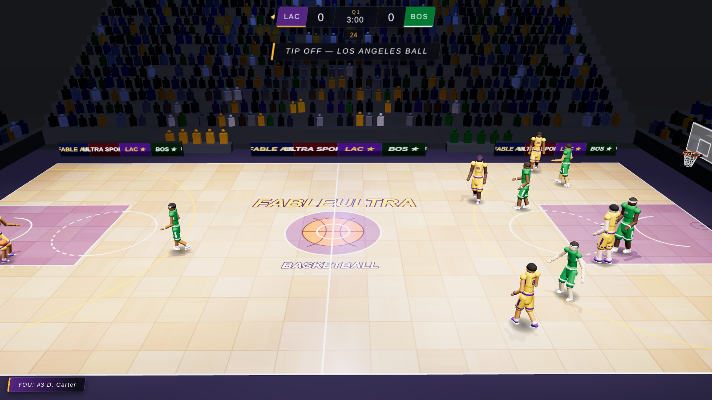

# FableUltra Basketball 🏀

A realistic 3D NBA-style basketball game that runs entirely in the browser — no build
step, no external assets, no dependencies to install. Everything (arena, players,
animations, textures, sound) is generated procedurally on top of a vendored Three.js.



## Play

Any static file server works:

```bash
# from the repo root
python3 -m http.server 8000
# then open http://localhost:8000
```

or `npx serve`, or open it through any web server. (Opening `index.html` directly
via `file://` won't work — ES modules require HTTP.)

## The game

- **5-on-5 full court** — Los Angeles (you) vs Boston (AI), with quarters, game clock,
  24-second shot clock, three-pointers behind a regulation arc, rebounds, steals,
  blocks, interceptions, out-of-bounds, buzzer beaters and overtime.
- **Timing-based shooting** — hold and release the shot button; a meter with a
  skill/contest/distance-dependent sweet zone decides the quality of your release.
  Drive the lane for layups, or pull up from deep.
- **AI teammates & opponents** — role-based spacing (PG/SG/SF/PF/C), cuts, drives,
  kick-out passes, man-to-man defense with help rotations, contests and box-outs.
- **Broadcast presentation** — sideline TV camera with smart framing and subtle zoom,
  ESPN-style scoreboard and lower-thirds, arena jumbotron, crowd that reacts to the
  action, and a fully synthesized soundscape (bounces, swishes, rim clanks, buzzer,
  sneaker squeaks, crowd swells) via WebAudio.

## Controls

| Action | Key |
| --- | --- |
| Move | `W` `A` `S` `D` / arrows |
| Sprint | `Shift` |
| Shoot (hold & release) / Block on defense | `Space` |
| Pass | `E` / `Enter` |
| Steal | `Q` |
| Switch defender | `Tab` |
| Camera view (broadcast / player / rim / sky) | `C` |
| Pause | `Esc` / `P` |

Arcade rules: no fouls, no free throws — everything else plays straight basketball.

## Tech

- [Three.js](https://threejs.org) r160 (vendored in `vendor/`), PBR materials,
  PCF soft shadows, ACES filmic tone mapping.
- Procedural everything: parquet court and ball textures painted on canvases,
  players built from a jointed capsule rig with a parametric/keyframe animation
  system, instanced crowd (~3000 spectators), synthesized audio.
- Custom ball physics: ballistic shot solver, rim torus + backboard collision,
  restitution, backspin.

```
index.html          entry point + import map
src/main.js         bootstrap, frame loop, module wiring
src/constants.js    court geometry (real NBA dimensions), physics, teams, rules
src/game.js         possession state machine, user control, shooting/passing/rebounds
src/ai.js           offensive spacing & decisions, man-to-man defense
src/playerModel.js  procedural player rig + animation engine
src/ball.js         ball visuals + physics + scoring detection
src/arena.js        court, hoops & nets, stands, crowd, jumbotron, lighting
src/cameraRig.js    broadcast camera
src/hud.js          menus, scoreboard, shot meter, toasts
src/audio.js        WebAudio synthesized SFX + crowd
src/controls.js     keyboard input
```
